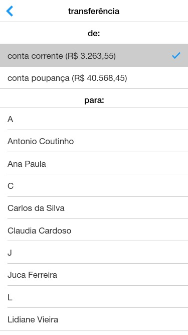
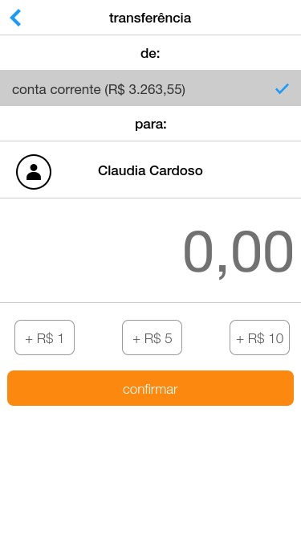

# mobile-test

## será avaliado

1. legibilidade
2. manutenção
3. testabilidade

## requisitos

* desenvolva a solução usando **Swift** ou **Kotlin**;
* não é necessário usar nenhum framework, utilize os recursos da linguagem;
* a comunicação deve ser feita utilizando APIs; 
* crie testes;
* coloque sua solução em um repositório GitHub;
* utilize o arquivo `README.md` para descrever seu raciocínio, lógica e detalhes da solução;
* quando terminar, envie o link do projeto por e-mail;
* seja criativo!

## orientações

* crie um modelo de JSON que faça sentido para construção da tela;
* o cliente irá selecionar entre uma conta corrente ou poupança para debito do valor a ser transferido;
* você pode ter quantos contatos quiser, mas eles precisam estar ordenados;
* para transferir, o cliente precisa selecionar uma conta origem e um contato;
* o cliente será direcionado para uma segunda tela, onde vai informar o valor e confirmar a transferência;
* ele só pode transferir valores até 10.000,00 por dia;
* informe sempre que uma requisição estiver sendo executada;
* mostre mensagens de erro e confirmação.

## telas sugeridas

 ___ 
